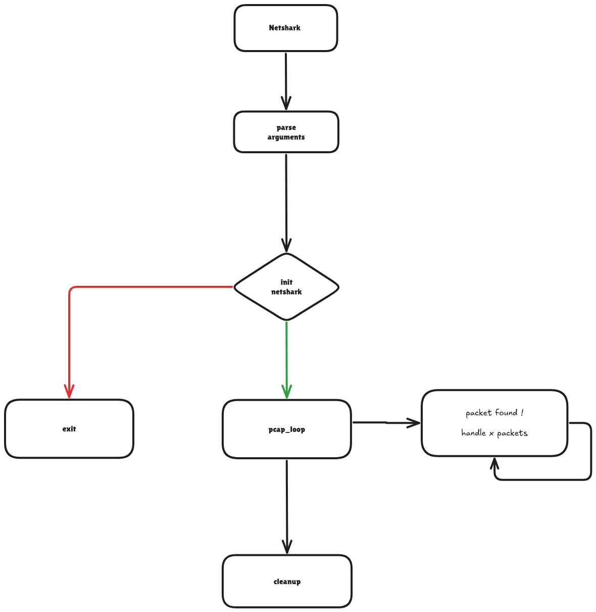

### NETSHARK 2600

```
███╗   ██╗███████╗████████╗███████╗██╗  ██╗ █████╗ ██████╗ ██╗  ██╗    ██████╗  ██████╗  ██████╗  ██████╗
████╗  ██║██╔════╝╚══██╔══╝██╔════╝██║  ██║██╔══██╗██╔══██╗██║ ██╔╝    ╚════██╗██╔════╝ ██╔═████╗██╔═████╗
██╔██╗ ██║█████╗     ██║   ███████╗███████║███████║██████╔╝█████╔╝      █████╔╝███████╗ ██║██╔██║██║██╔██║
██║╚██╗██║██╔══╝     ██║   ╚════██║██╔══██║██╔══██║██╔══██╗██╔═██╗     ██╔═══╝ ██╔═══██╗████╔╝██║████╔╝██║
██║ ╚████║███████╗   ██║   ███████║██║  ██║██║  ██║██║  ██║██║  ██╗    ███████╗╚██████╔╝╚██████╔╝╚██████╔╝
╚═╝  ╚═══╝╚══════╝   ╚═╝   ╚══════╝╚═╝  ╚═╝╚═╝  ╚═╝╚═╝  ╚═╝╚═╝  ╚═╝    ╚══════╝ ╚═════╝  ╚═════╝  ╚═════╝
```

### Installation

1. **Install Dependencies**

   - Install the PCAP development library:
     ```bash
     sudo apt-get install libpcap-dev  # For Debian/Ubuntu
     sudo yum install libpcap-devel    # For CentOS/RHEL
     ```

2. **Clone the Repository**

   ```bash
   git clone https://github.com/NetCore2600/Netshark.git
   cd netshark
   ```

3. **Build the Project**

   ```bash
   make
   ```

4. **Run the Program**
   ```bash
   ./netshark -i <interface> -f <filter>
   ```

Note: The program requires root privileges to capture network packets. Run it with `sudo` if needed.

### Architecture



Netshark is a network packet analyzer built with a modular and layered architecture. Here's how the components work together:

1. **Project Structure**

   ```
   netshark/
   ├── src/           # Source code
   │   ├── main.c     # Entry point and argument parsing
   │   ├── init.c     # Initialization routines
   │   └── handler.c  # Packet handling logic
   ├── include/       # Header files
   │   ├── netshark.h # Main application interface
   │   ├── protocol.h  # Packet handler interface
   │   ├── tcp.h       # Argument tcp interface
   │   ├── udp.h       # Argument udp interface
   │   ├── arp.h       # Argument arp interface
   │   ├── http.h      # Argument http interface
   │   └── ftp.h       # Argument ftp interface
   ├── build/         # Compiled objects and binaries
   └── Makefile       # Build configuration
   ```

2. **Core Components**

   - **Main Application** (`main.c`)

     - Entry point of the program
     - Handles command-line arguments
     - Initializes the application
     - Manages the main event loop

   - **Packet Handler** (`handler.c`)

     - Processes captured network packets
     - Analyzes TCP/IP headers
     - Implements packet filtering
     - Formats and displays packet information

   - **Initialization** (`init.c`)
     - Sets up network interfaces
     - Configures packet capture
     - Manages resource allocation

3. **Data Flow**

   1. User inputs interface and filter parameters
   2. Main initializes the application
   3. Packet handler captures network traffic
   4. Packets are processed and analyzed
   5. Results are displayed in real-time

4. **Key Features**
   - Real-time packet capture
   - TCP/IP packet analysis
   - Flexible packet filtering
   - Detailed packet information display
   - Cross-platform compatibility

The architecture is designed to be modular, making it easy to maintain and extend. Each component has a clear responsibility, and the code is organized to separate concerns between packet capture, processing, and display.


### What is a packet ?
[ Ethernet (14 bytes) ]
[ IP (20-60 bytes) ]
[ TCP (20+ bytes) ]
[ Payload ]

<br>
<br>

## Network Layer

1. **Ethernet format**
 +-+-+-+-+-+-+-+-+-+-+-+-+-+-+-+-+-+-+-+-+-+-+-+-+-+-+-+-+-+-+-+-+
 |                Destination MAC Address (6 bytes)              |
 +-+-+-+-+-+-+-+-+-+-+-+-+-+-+-+-+-+-+-+-+-+-+-+-+-+-+-+-+-+-+-+-+
 |                Source MAC Address (6 bytes)                   |
 +-+-+-+-+-+-+-+-+-+-+-+-+-+-+-+-+-+-+-+-+-+-+-+-+-+-+-+-+-+-+-+-+
 |           EtherType / Length (2 bytes)                        |
 +-+-+-+-+-+-+-+-+-+-+-+-+-+-+-+-+-+-+-+-+-+-+-+-+-+-+-+-+-+-+-+-+
 |                  Payload (e.g., ARP, IP, etc.)                |
 ~                                                               ~
 |                                                               |
 +-+-+-+-+-+-+-+-+-+-+-+-+-+-+-+-+-+-+-+-+-+-+-+-+-+-+-+-+-+-+-+-+
 |                  FCS (4 bytes, CRC32, not always shown)       |
 +-+-+-+-+-+-+-+-+-+-+-+-+-+-+-+-+-+-+-+-+-+-+-+-+-+-+-+-+-+-+-+-+

2. 🧠 What does EtherType do?
It tells the receiving host what protocol to use to interpret the payload.
Think of it like a "label" for the contents.
Full list: [IEEE EtherType Assignments](https://standards-oui.ieee.org/ethertype/eth.txt)

<br>
<br>

### ARP
RFC: https://datatracker.ietf.org/doc/html/rfc826

<br>

packet structure

0          1          2         3         4
+----------+----------+---------+---------+
|                  32 bits                |
|-----------------------------------------|
|   Hardware Type     |     Protocol Type |
|-----------------------------------------|
| Hardware | Protocol |     Operation     |
| Length   | Length   | 1:Request 2:Reply |
|-----------------------------------------|
|        Sender Hardware Address          |
|-----------------------------------------|
|        Sender Protocol Address          |
|-----------------------------------------|
|        Target Hardware Address          |
|-----------------------------------------|
|        Target Protocol Address          |
+-----------------------------------------+

<br>

### 🔍 Here's how ARP typically works:
1. **Client initiates ARP request**
When a host (e.g., your computer) wants to send an IP packet to another device on the **same local network (LAN)**, it needs the **MAC address** of the destination.

- If the destination is on the same subnet:
   - The client sends an **ARP Request:** *“Who has IP X.X.X.X? Tell me your MAC.”*

- If the destination is outside the subnet:
   - The client instead needs the MAC address of the default gateway (router).
   - So the client sends an ARP request for the router’s IP address.

In both cases, the **client initiates** the ARP request.

<br>
<br>

## Internet Layer

+------+ +-----+ +-----+     +-----+
|Telnet| | FTP | | TFTP| ... | ... |
+------+ +-----+ +-----+     +-----+
      |   |         |           |
      +-----+     +-----+     +-----+
      | TCP |     | UDP | ... | ... |
      +-----+     +-----+     +-----+
         |           |           |
      +--------------------------+----+
      |    Internet Protocol & ICMP   |
      +--------------------------+----+
                     |
      +---------------------------+
      |   Local Network Protocol  |
      +---------------------------+

         Protocol Relationships

               Figure 1.

<br>

1. Internet Header Format

from https://datatracker.ietf.org/doc/html/rfc791


A summary of the contents of the internet header follows:


0                   1                   2                   3
0 1 2 3 4 5 6 7 8 9 0 1 2 3 4 5 6 7 8 9 0 1 2 3 4 5 6 7 8 9 0 1
+-+-+-+-+-+-+-+-+-+-+-+-+-+-+-+-+-+-+-+-+-+-+-+-+-+-+-+-+-+-+-+-+
|Version|  IHL  |Type of Service|          Total Length         |
+-+-+-+-+-+-+-+-+-+-+-+-+-+-+-+-+-+-+-+-+-+-+-+-+-+-+-+-+-+-+-+-+
|         Identification        |Flags|      Fragment Offset    |
+-+-+-+-+-+-+-+-+-+-+-+-+-+-+-+-+-+-+-+-+-+-+-+-+-+-+-+-+-+-+-+-+
|  Time to Live |    Protocol   |         Header Checksum       |
+-+-+-+-+-+-+-+-+-+-+-+-+-+-+-+-+-+-+-+-+-+-+-+-+-+-+-+-+-+-+-+-+
|                       Source Address                          |
+-+-+-+-+-+-+-+-+-+-+-+-+-+-+-+-+-+-+-+-+-+-+-+-+-+-+-+-+-+-+-+-+
|                    Destination Address                        |
+-+-+-+-+-+-+-+-+-+-+-+-+-+-+-+-+-+-+-+-+-+-+-+-+-+-+-+-+-+-+-+-+
|                    Options                    |    Padding    |
+-+-+-+-+-+-+-+-+-+-+-+-+-+-+-+-+-+-+-+-+-+-+-+-+-+-+-+-+-+-+-+-+

<br>
<br>

## Transport Layerz

### TCP


<br>
<br>

## Application Layer

<br>

### HTTP

RFC: https://datatracker.ietf.org/doc/html/rfc7540
